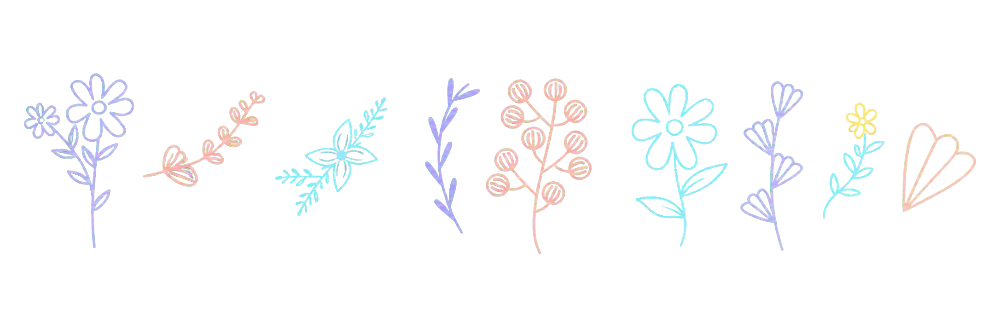

# Ksenia Shlenskaia

**Software developer since 2021**

Web development · Helsinki · BEng

[Portfolio](https://x-bananer.github.io/portfolio) · [LinkedIn](https://www.linkedin.com/in/kseniia-shlenskaia-502004353/) · [LeetCode](https://leetcode.com/u/x-bananer/)

<picture>
  <source media="(prefers-color-scheme: dark)" srcset="https://raw.githubusercontent.com/x-bananer/x-bananer/output/github-snake-dark.svg">
  
</picture>

## Core Stack
### Languages

    
    
    

### Frontend

    
    
    

### Backend

    
    
    

### Data

    
    

### Testing & Delivery

    
    
    
    

## Reading & Recommending
- *Clean Architecture*
- *Designing Data-Intensive Applications*
- *Operating Systems: Three Easy Pieces*

  &nbsp;&nbsp;&nbsp;&nbsp;&nbsp;&nbsp;&nbsp;&nbsp;&nbsp;&nbsp;&nbsp;&nbsp;&nbsp;&nbsp;&nbsp;&nbsp;&nbsp;&nbsp;&nbsp;&nbsp;&nbsp;&nbsp;&nbsp;&nbsp;&nbsp;&nbsp;&nbsp;&nbsp;&nbsp;&nbsp;&nbsp;&nbsp;&nbsp;&nbsp;&nbsp;
  

* *In Search of Schrodinger's Cat*

## GitHub Activity

